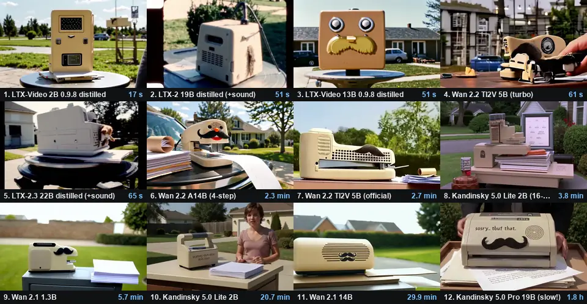

# videobench

By Dave Euson.

How fast can this computer turn a prompt into a 5-second AI video, and which open video
model makes the best one?

videobench runs everything locally. It installs its own ComfyUI and PyTorch into one
folder, downloads the models it needs from Hugging Face, and runs them. It gives you the
clip, the time each stage took, and a gallery page to compare runs.



*One prompt (a 1990s infomercial for an apologetic stapler), twelve models, one RTX 4070.
Fastest first, with each model's time for the whole clip.*

```
still (Z-Image-Turbo)  ->  encode (T5 + VAE)  ->  sample (LTX-Video)  ->  decode (VAE)  ->  mp4
```

It does three things:

- **The benchmark.** One fixed test that compares across machines: the same models,
  prompt, seed and settings everywhere.
- **The lineup.** Up to 18 video models make the same prompt, side by side. It shows what
  fits your GPU and how long each one should take.
- **Voices.** Text-to-speech engines read the same lines, and Whisper checks every read
  against the script.

## Run it

You need Python 3.10+ and git; without git, videobench downloads GitHub zips instead. An
NVIDIA GPU with 8 GB+ works on Windows or Linux. AMD (ROCm) works on Linux, and so does
Apple Silicon.

Get this repository (`git clone`, or **Code > Download ZIP**), then:

```
python videobench.py
```

In a terminal it asks what to make, and which models. Press Enter for the standard
benchmark. The first run sets everything up in `./videobench`; `--dir` puts it somewhere
else:

```
python videobench.py --dir D:\videobench
```

**Nothing runs in the background.** videobench starts its own copy of ComfyUI on
`127.0.0.1:8190` for each run and stops it when the run ends. You don't need ComfyUI
installed. If you already have it, `--comfy PATH` reuses that install (videobench still
starts and stops its own process). Close other GPU-heavy apps first, including an open
ComfyUI: they compete for the same VRAM.

Disk: about 25 GB for the benchmark including PyTorch. Lineup models are 7 to 56 GB each,
but they share text encoders and VAEs; the menu shows what each one downloads.

## Commands

```
python videobench.py --list-models             # every video model: does it fit here, how long, its license
python videobench.py --models ltxv-2b,wan-2.2-5b   # run these on the same prompt
python videobench.py --models fits             # everything that fits in VRAM ('all': everything that runs)
python videobench.py --update-models           # fetch the latest model list
python videobench.py --prompt "a cat surfing a wave at sunset"   # your own video
python videobench.py --out D:\Videos           # save the clip there too, named from the prompt
python videobench.py --profile quality         # the benchmark with LTX-Video 13B at 768x512
python videobench.py --list                    # the benchmark's plan and downloads; changes nothing
python videobench.py --watch                   # follow a run from another terminal
python videobench.py --verify                  # check downloaded models against their SHA-256
python videobench.py --gallery                 # rebuild gallery.html
python videobench.py --voices                  # the voice lineup (--list-voices shows the engines)
```

Scripts and services never get a question. `--no-ask` does the same in a terminal.

## The lineup

| key | model | released | license |
|---|---|---|---|
| `minimax-h3` | MiniMax H3 (turbo LoRA, with sound) | 2026-08 | MiniMax H3 Community: **not licensed in the EU, UK, South Korea or US** |
| `ltx-2.5` | LTX-2.5 22B distilled (with sound; gated, needs `HF_TOKEN`) | 2026-07 | LTX-2.x Community |
| `ltx-2.3` | LTX-2.3 22B + distilled LoRA (with sound) | 2026-03 | LTX-2 Community |
| `ltx-2` | LTX-2 19B distilled (with sound) | 2026-01 | LTX-2 Community |
| `hunyuan-1.5` | HunyuanVideo 1.5 480p (4-step LoRA) | 2025-11 | Hunyuan Community: **not licensed in the EU, UK or South Korea** |
| `kandinsky-5` | Kandinsky 5.0 Lite 2B (50 steps, CFG 5; the most lifelike, and slow) | 2025-11 | MIT |
| `kandinsky-5-nocfg` | Kandinsky 5.0 Lite 2B no-CFG (about half the time) | 2025-11 | MIT |
| `kandinsky-5-16step` | Kandinsky 5.0 Lite 2B distilled (16 steps, about 6x faster) | 2025-11 | MIT |
| `kandinsky-5-pro` | Kandinsky 5.0 Pro 19B (43 GB, loads as fp8; hours per clip) | 2025-11 | MIT |
| `wan-2.2-14b` | Wan 2.2 A14B (4-step LoRAs) | 2025-07 | Apache-2.0 |
| `wan-2.2-5b` | Wan 2.2 TI2V 5B (community turbo, 4 steps) | 2025-07 | Apache-2.0 |
| `wan-2.2-5b-official` | Wan 2.2 TI2V 5B (official weights, 20 steps) | 2025-07 | Apache-2.0 |
| `ltxv-13b` | LTX-Video 13B 0.9.8 distilled | 2025-07 | LTXV Open Weights |
| `ltxv-2b` | LTX-Video 2B 0.9.8 distilled | 2025-07 | LTXV Open Weights |
| `wan-2.1-14b` | Wan 2.1 14B | 2025-02 | Apache-2.0 |
| `wan-2.1-1.3b` | Wan 2.1 1.3B | 2025-02 | Apache-2.0 |
| `hunyuan-1.0` | HunyuanVideo 1.0 13B (embedded guidance, 20 steps) | 2024-12 | Hunyuan Community: **not licensed in the EU, UK or South Korea** |
| `mochi-1` | Mochi 1 10B (30 fps) | 2024-10 | Apache-2.0 |

Every model is text-to-video with the settings from ComfyUI's own template for it,
trimmed to one pass (no upscaler, no AI prompt rewriter), so runs compare. For this
machine, the menu says **fits in VRAM**, **fits with offloading** (bigger than VRAM, so it
streams from system RAM: it works, just slower), or **too big**. Times are estimates, scaled
from an RTX 4070 by a one-second GPU speed test, until a model has run on this machine.
After that the menu shows the measured time. A model that fails (out of memory, a download
error) drops out and the rest carry on.

Where a template uses FP4 text encoders (native only to RTX 50 cards), videobench uses the
fp8 or int8 versions, so they run on RTX 30 and 40 cards too.

### Licenses

videobench is MIT. The models are not part of it: each keeps its own license, and
videobench downloads them from Hugging Face on your machine. The table's license names are
short summaries, not legal advice. Read the license before you use a model's output for
anything. Two license families come with extra terms:

- LTX-2.x: free for companies under $10M annual revenue. Its text encoder is under Gemma's
  terms.
- MiniMax H3: companies over $20M revenue need MiniMax's written OK.

**Some licenses exclude whole countries** (MiniMax H3, both HunyuanVideos). The first time
you open the menu, videobench asks where you are: two letters, like `US`, `GB`, `DE` or
`JP`. It then offers only what's licensed there. The answer stays in `settings.json` in
`--dir`; it isn't sent anywhere and isn't written into results. Scripts use
`--country XX`. If you skip the question, those models stay off.

LTX-2.5 is gated. Accept its license at [huggingface.co/Lightricks/LTX-2.5](https://huggingface.co/Lightricks/LTX-2.5),
make a read token at huggingface.co/settings/tokens, then set `HF_TOKEN` before running.

## New models

The lineup lives in [`models.json`](models.json), not in the code. For each model it
lists:

- its files: Hugging Face URLs, sizes, and a SHA-256 for each
- which builder in `videobench.py` turns it into a ComfyUI workflow
- the builder's settings
- its license

When the list changes, you get it with:

```
python videobench.py --update-models
```

That fetches the newest `models.json` into `--dir` and says what's new. It downloads no
model weights; a model downloads when you first run it. Whichever list has the higher
`revision` wins: the copy saved in `--dir`, or the one beside `videobench.py`.

How a new model gets into the list:

1. **Found automatically.** Once a day, a GitHub Action compares ComfyUI's official
   template list with `models.json`. It opens an issue for any open-weights text-to-video
   model the lineup doesn't have. ComfyUI usually adds a template within days of a
   release.
2. **Added.** A new version of a family videobench knows (the next LTX, Wan or Kandinsky)
   is a `models.json` entry using an existing builder. That reaches everyone through
   `--update-models`, with no new videobench. A new family needs a builder in
   `videobench.py`, so it arrives as a new release.
3. **Checked.** The same daily Action checks every pinned file against Hugging Face and
   opens an issue if one changes upstream. Until the list is updated, a download that
   doesn't match its pinned SHA-256 stops with an error instead of running an unknown file.

Only `.safetensors` and `.gguf` files from huggingface.co are accepted: formats that can't
carry code. Pull requests adding models are welcome. The builders show which parts
(`dit`, `te`, `vae` ...) and settings each one takes, and `tests/` checks the rest.

## Profiles (the benchmark)

| profile | still | clip | video model |
|---|---|---|---|
| `fast` | 1024x768, 8 steps | 640x480, 121 frames, 24 fps, 8 steps | LTX-Video 2B distilled, fp8 |
| `quality` | 1152x768, 8 steps | 768x512, 121 frames, 24 fps, 8 steps | LTX-Video 13B distilled, Q3_K_M GGUF |

Both use seed 24 and this prompt: "A dog running in a field chasing a thrown ball, sunny
afternoon." The clip prompt adds "the camera tracking alongside."

Before starting, videobench samples GPU load for 3 seconds (NVIDIA). If something else is
busy, it warns you and flags the result: close GPU-heavy apps for a clean benchmark. A
custom `--prompt` runs the same pipeline, but its times don't compare across machines, and
it's marked as custom.

## What you get

Everything goes in `--dir`:

- `results/<time>-<profile>.json`: one run.
- `results.jsonl`: every run, one per line.
- `gallery.html`: every run with its clip. Open it in a browser.
- `output/videobench/`: the stills and mp4s.

A result file:

```json
{
  "videobench": "1.4.0", "run": "20260910-123000-fast", "profile": "fast", "status": "ok",
  "machine": { "gpu": "NVIDIA GeForce RTX 4070", "vram_gb": 12.0, "unified_memory": false,
               "cpu": "AMD Ryzen 9 9900X 12-Core Processor", "ram_gb": 61.6, "os": "Windows 11",
               "driver": "610.62", "backend": "cuda", "torch": "2.14.0+cu130", "jetson": false },
  "settings": { "video_model": "LTX-Video 2B distilled (fp8)", "clip_size": "640x480", "frames": 121, "fps": 24, "seed": 24 },
  "stages": { "still": 0.0, "clip_encode": 0.0, "clip_sample": 0.0, "clip_decode": 0.0 },
  "total_seconds": 0.0,
  "memory": { "gpu_used_max_mb": 0, "ram_available_min_mb": 0 },
  "files": { "still": "output/videobench/...png", "clip": "output/videobench/...mp4" }
}
```

Results describe the hardware, not the computer: there's no machine name in them, so
they're safe to share. Every stage includes loading its model from disk, and every model
is unloaded after its stage, so the times are cold-start: what someone running it once
will see.

`tools/lineup_grid.py` turns a lineup into a side-by-side grid like the one at the top.
Run it with videobench's own venv Python, which has the PyAV and Pillow it needs.

## Share your result

Ran it? [Share a result](https://github.com/DaveEuson/AI-Video-Bench/issues/new?template=share-result.yml),
so everyone can see what each GPU can do. videobench prints that link after every run
that finishes. Paste the `results/<run>.json` it wrote. That file has no computer name in
it, but its `files` section can show folder paths with your user name; delete that part if
you like.

To use videobench from another program, run `python videobench.py --dir <folder> --no-ask`
with the options you want, then read `results/<run>.json`. `status` is `ok` or `failed`
(with `error`). `total_seconds`, `stages` and `memory` are the numbers.

## Low-memory mode

This turns on automatically on unified-memory machines (Jetson). It was worked out on an
8 GB Jetson Orin Nano:

- **Weights stay on disk.** ComfyUI runs with `--disable-dynamic-vram --novram`; weights
  stay memory-mapped and stream to the GPU a layer at a time.
- **Two patches to ComfyUI-GGUF**, active only with `GGUF_KEEP_MMAP=1`:
  - It doesn't copy a "released" mmap into RAM.
  - Big text-encoder embeddings are dequantized in chunks.
- **A memory fence.** On Linux, ComfyUI runs in a `systemd-run --user` scope capped at RAM
  minus 2 GB. If it runs out, the kernel stops ComfyUI, not the desktop.
- **Smaller decode tiles:** 256 px and 32 frames.

PyTorch for Jetson isn't on PyPI. Point videobench at a Python that already has CUDA torch:

```
python3 videobench.py --python /path/to/venv/bin/python --comfy /path/to/ComfyUI
```

## Pinned versions

- ComfyUI `e5a38e3` (Aug 2026) and ComfyUI-GGUF `6ea2651`.
- PyTorch is picked from your driver: NVIDIA driver 580+ gets cu130, 570+ gets cu128, and
  older drivers get cu126. AMD on Linux gets ROCm 6.4. `--torch-index` overrides the
  choice.

## Tests

```
python -m unittest discover -s tests -v
```

Standard library only. The tests cover the model list and its checks, and every ComfyUI
workflow compared against the ones videobench 1.3.0 built. They also cover the
country rules, `--update-models`, and the daily check. The GPU parts can't run in CI, so
each release is also run by hand on a real GPU.

## License

MIT, for videobench itself. See [LICENSE](LICENSE). The models are each under their own
license (above). videobench isn't affiliated with any of the model makers.
